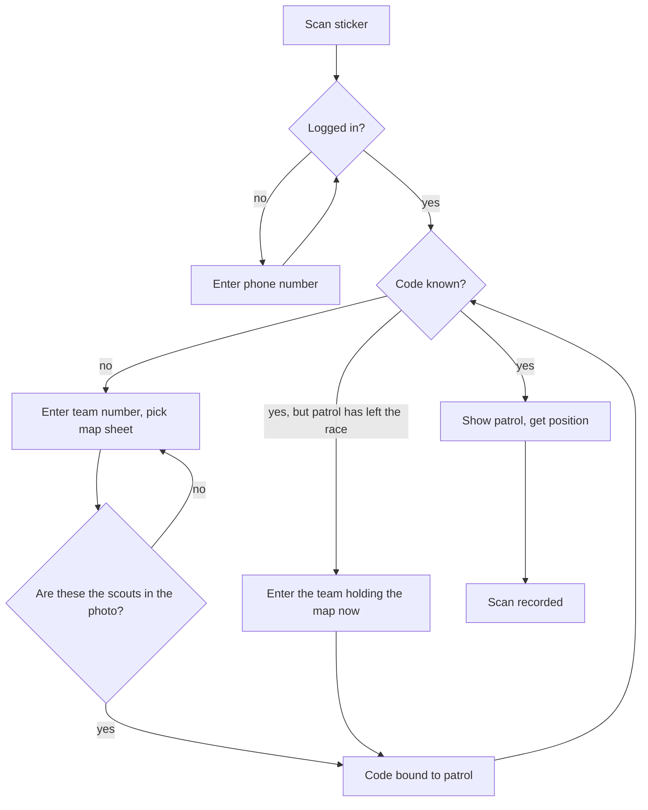
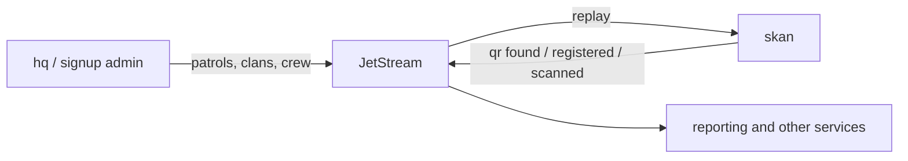

# Nathejk Skan

QR scanning for the Nathejk night race.

Nathejk is a Danish scouting race: patrols (*patruljer*) navigate from checkpoint
to checkpoint through the night while *banditter* hunt them. Every patrol carries
a paper map with a unique QR sticker, and they get a fresh map — with a fresh
sticker — several times during the race.

**Skan is what your phone opens when you scan one of those stickers.** Checkpoint
crew scan a patrol when it arrives; bandits scan a patrol when they catch it. Each
scan is stored with who scanned, when, and where.

### Vocabulary

The domain is Danish and stays Danish in the code and the UI:

| Term | Meaning |
|---|---|
| *patrulje* | a patrol — the scout team being hunted |
| *spejder* | a scout, a member of a patrulje |
| *klan* | a clan — a group of seniors |
| *senior* / *bandit* | **the same person.** A senior signed up to a klan *is* a bandit; `senior` is the signup word, `bandit` is the race word |
| *holdnummer* | team number — the big number on the scouts' arms |
| *post* | a checkpoint |
| *lok* | a camp location a klan operates from |

---

## How it works

### 1. Codes are generated before the race

`GET /qr?n=500&token=…` returns a CSV of `id,url` — one line per sticker:

```
1,https://skan.nathejk.dk/qr/1/2394859
2,https://skan.nathejk.dk/qr/2/1029384
```

The trailing number is a checksum of the id plus a shared secret, so the URLs
can't be guessed by counting upwards. The CSV goes to whoever prints the
stickers. Ids are scoped to the event year, so last year's stickers cannot be
confused with this year's.

Because this endpoint hands out working URLs for codes nobody has seen yet, it is
guarded by a secret token in the query string rather than by a login.

**There is no way to record a scan without a code.** A manual "type the team number"
form used to exist and was deliberately removed — this service handles real QR codes
only.

> Changing the `SECRET` environment variable invalidates every sticker already
> printed.

### 2. The first scan binds a code to a patrol

A freshly printed code means nothing to the system. The first scanner is asked
for the patrol's **team number** — the large number on the scouts' arms, not the
small number printed beside the QR code — and for **which map sheet** they are handing
over, chosen from the set drawn up for the scouts. Confirming ties that sticker to that
patrol and that sheet for the rest of the race.

Because a patrol receives its first map at the start of the race, and **no patrol may
start without having been photographed**, a photograph always exists at this point.
The scanner therefore confirms against the patrol's actual photo: *are these the
scouts in the picture?* A mistyped team number is the mistake this catches, and it is
worth catching — every later scan of that map is attributed to whichever patrol was
named here.

The photograph is shown large enough to actually recognise faces in — roughly a
thousand pixels wide, not a list thumbnail. It is the identity check, and squinting at
it is not a check.

If the scanner is on duty at a checkpoint where maps are handed out, that checkpoint's
sheet is preselected for them. It is only ever a suggestion: if the duty roster leaves
any doubt about which sheet is being handed over, nothing is preselected and the scanner
chooses.

**A code can be re-bound.** If a patrol shrinks below three, its remaining scouts join
another team and bring their map with them. So scanning a code belonging to a patrol
that has left the race asks for the *holdnummer* of whoever holds it now, and moves the
map — a different question, in different words, from binding a code that has never been
used.

### 3. Every later scan is just a scan

Once a code is known, scanning it shows the patrol (name, arm number, photo) and
records the scan. The page asks the browser for GPS coordinates — keeping the accuracy
it reports, since a fix under trees can be hundreds of metres out — and if that's
refused or unavailable, it shows a map instead: zoom in, place a marker, and the
position is saved and flagged as manually set. A hand-placed marker is never mistaken
for a GPS fix, and carries no accuracy figure, because there is no measurement behind
it.

### 4. Logging in

Scanning is not anonymous. A visitor without a session is asked for their phone
number, which is matched against event personnel and clan seniors already
registered in the Nathejk system. That lookup is also what decides whether the
scanner is **crew** (found among personnel) or a **bandit** (found among the
seniors — a senior signed up to a klan *is* a bandit) — the two roles are intended
to see different things after a scan. There is no role picker: your phone number
*is* your role.

If the same phone number is registered both as crew and as a senior in the same year,
the app can't tell which one you are — so it refuses the login and asks you to contact
HQ to get one of the registrations removed. Being crew one year and a senior another is
fine: only the year being run is consulted.

### 5. Bandits and crew see different things

**Bandits may only learn about bandits — it has to be a fair game.** A bandit is a
player, so anything they learn about how a patrol is doing in the race is an
unfair advantage. A bandit's scan result is limited to what their own side
produced: how many times that patrol has been caught by bandits.

Crew are not players — they might be checkpoint personnel, a guide walking with
the scouts, or a samarit taping up blisters. **Crew see everything.**

| After scanning a patrol | Bandit | Crew |
|---|---|---|
| Who the patrol is (name, arm number, photo) | yes | yes |
| How many scouts to expect | yes | yes |
| How many times bandits have caught them | yes | yes |
| Total number of scans, checkpoints included | no | yes |
| Checkpoint activity and positions | no | yes |

A bandit's page is not merely missing those figures — they are never sent to the
browser, and not even looked up.

### 6. Counting the scouts

Every scan shows **how many scouts should be there**, and asks the scanner to count them.
That number is the patrol's current strength, which is not always the number it started
with: a patrol that drops below three cannot continue alone, so its remaining members are
reassigned to other teams — meaning a team can grow as well as shrink.

Because the armband the scouts wear shows the number they *started* with, any change leaves
the armband out of date. When that happens the page adds a yellow *vær opmærksom* note
saying which way it moved, so nobody counts heads against the armband and draws the wrong
conclusion.

### 7. Catching the same patrol twice

Bandits do catch the same patrol more than once during a night, so **a rescan
counts**. To stop accidental double scans from inflating the tally, there's one
guard: if the patrol's most recent scan was by *you*, less than *30 minutes* ago,
you're asked to confirm that this really is a new catch.

So two scans half an hour apart just count, and so do two of your scans with
another scanner's in between — only an immediate repeat by the same person asks a
question.



---

## Where Skan sits

Skan is one service in a larger Nathejk setup. Services talk to each other over
NATS JetStream rather than by calling each other.



Skan **publishes** three facts: a code was *found*, a code was *registered* to a
patrol, a code was *scanned*. Everything Skan knows about patrols, clans, seniors
and crew it **learns by listening** — those records are created elsewhere.

A local MariaDB holds only a cache of that event history, rebuilt from scratch on
every start. It is safe to delete.

Scan data is also available to other tooling. Both of these are **machine
endpoints guarded by a secret token in the query string**, not by the phone login:

- `GET /qr?n=N&token=…` — the sticker-printing CSV described above
- `GET /geo` — all scans that have coordinates, as JSON, for map/GIS export

The token is a different secret from the QR checksum secret, and it must not be
handed to bandits — `/geo` is a live map of the whole race.

- `GET /healthcheck` — liveness probe, open by design

---

## Running it locally

Everything runs in Docker. You do not need Go installed.

**Prerequisites:** the shared Nathejk infrastructure (Traefik and NATS
JetStream) must be running, providing the external `traefik` and `jetstream`
Docker networks.

```sh
docker compose up
```

| What | Where |
|---|---|
| The app | https://skan.local.nathejk.dk |
| Database admin (Adminer) | http://mysql.skan.local.nathejk.dk |
| Redis admin | http://redis.skan.local.nathejk.dk |

Each service registers itself with Traefik directly — there is no gateway container.
The app is served over **both** HTTP and HTTPS. Use the HTTPS URL: the browser only
grants geolocation in a secure context, and the printed sticker URLs are `https://`
for that reason. HTTP is served rather than redirected on purpose — a redirect would
turn a scan's POST into a bodyless GET and lose it.

The production image is deliberately **not** a compose service, since building it runs
the full test/lint/vulnerability gate. Build it explicitly:

```sh
docker build -f docker/Dockerfile --target prod -t skan:local .
```

The Go process rebuilds and restarts itself on every file change under `go/`
(via [air](https://github.com/air-verse/air)), and runs the test suite as part of
each rebuild.

Run a one-off command in the container:

```sh
docker compose run --rm api go test ./...
```

> Heads up: the dev stack talks to the JetStream broker on the shared `jetstream`
> network at `nats://jetstream:4222`.

---

## Layout

```
skan/
├── docker-compose.yml     dev stack
├── docker/Dockerfile      dev / build / prod stages
├── roadmap/tasks/         the task board
├── webroot/               static files
└── go/                    the entire application
    ├── main.go            wiring
    ├── routes.go          routes and handlers
    ├── templates/         the HTML pages
    ├── nathejk/commands/  publishing events (the write side)
    ├── nathejk/table/     turning events into SQL tables (the read side)
    └── internal/login/    phone-number login
```

Pages are rendered server-side with Go's `html/template`. There is no frontend
build step and no SPA — deliberately. A scan has to load instantly on an unknown
phone over a weak signal in a field at 2am, and the forms work even if JavaScript
never runs.

The streaming and projection plumbing now runs entirely on
`github.com/jrgensen/stream` and `github.com/jrgensen/cqrs`; the in-repo `superfluids/`
and `pkg/tablerow/` packages they replaced have been deleted. Projections are lifted to
`github.com/nathejk/shared-go` once they stabilise, and several here — `photo`,
`photocover`, `kort`, `spejderstatus`, `checkpoint`, `checkpersonnel` — are copies of
other services' packages, kept close to their originals so they can be moved without
edits.

Patrol photographs are not stored here. The projections hold content-hash refs, and
the bytes come from the `foto` service at `<foto-base-url>/photos/<ref>`. Skan never
asks for the original file: it carries the camera's metadata, including where the
picture was taken.

Some directories were inherited from sibling Nathejk repos and never used here; they
have now been deleted (task 012). This app was a PHP/Twig application before the port
to Go; those original templates are gone too.

---

## Configuration

| Variable | Purpose |
|---|---|
| `YEAR` | The event year, e.g. `2026`. **Required** — the app refuses to start without it, deliberately, since a wrong year silently finds no data. |
| `SECRET` | Seeds the QR URL checksum. **Required.** Changing it breaks printed stickers, so never expose it in a URL. |
| `EXPORT_TOKEN` | **Required.** The secret token for `/qr` and `/geo`, passed as a query parameter. Deliberately a different secret from `SECRET`; a bad or missing token gets a `404`. |
| `FOTO_BASE_URL` | **Required.** Base URL of the `foto` service, e.g. `https://foto.local.nathejk.dk`. Patrol photos live at `<base>/photos/<ref>`. |
| `JETSTREAM_DSN` | NATS JetStream connection |
| `DB_DSN` | MariaDB connection. Needs `multiStatements=true` — one projection's schema declares two tables at once. |
| `WEBROOT` | Static file directory |

---

## Known gaps

Short, honest list — details and more items in `.rules`, tracked as tasks under
`roadmap/tasks/`.

- **The login cookie is unsigned**, so a scanner's identity can be forged. Fine
  for a scouting race, not fine for anything sensitive.
- **Three event fields are skan-local** (`locationSource`, `locationAccuracy`, `mapId`).
  They are added additively to the shared event bodies and should be upstreamed into
  `shared-go` so other services can rely on them.
- **`shared-go` dropped `teamId` from the senior event** while publishers still send it,
  so skan restores it locally. That one is a bug to fix upstream.
- **There is no per-patrol remark.** The old app could show a red note about a patrol;
  no projection holds one, so the markup was removed rather than faked.
- **Two copied projections were fixed here and diverge from their originals.**
  `checkpoint` and `checkpersonnel` re-inserted every row on every replay; they now
  upsert. Re-copying either from `hq` would silently undo that — diff first, and push the
  fix upstream.
- **No `checkgroup` projection.** Without it the `kort` package's own map query can't run,
  so skan asks narrower questions of the tables it does have. Copying `checkgroup` in
  would let that local code retire.

---

## Contributing

See `.rules` (this repo) and `.agents/rules/rules.md` (org-wide) for conventions:
branch naming, commit format, and the rule that handlers publish events rather
than writing to the database directly.

Work is tracked on a file-based board in `roadmap/tasks/` — `open/`, `doing/` and
`done/` folders holding one Markdown file per task, with the conventions in
`roadmap/tasks/TASKS.md`. All 20 filed tasks are done and `open/` is currently empty;
the gaps listed above are open by choice, not by oversight.
